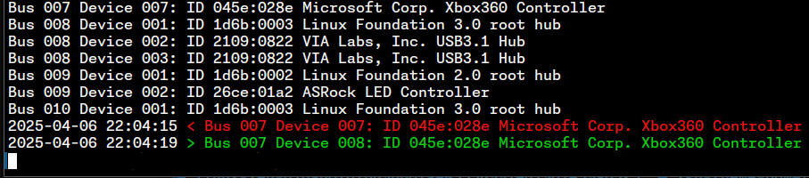

# usbdiff

Monitors for changes in your USB devices, disconnects and connects, and shows them in a convenient output format.

For a graphical version check out [usbdiff-gui](https://github.com/lietu/usbdiff-gui).

Depends on `lsusb`, `diff`, and `bash`, this means it likely only supports Linux.

Once you clone this repository or otherwise download the `usbdiff` -script, you should be able to run it.

Usage:

```bash
chmod +x usbdiff
./usbdiff
```



## How is it licensed?

This code is licensed under the [BSD 3-clause license](LICENSE.md).

# Financial support

This project has been made possible thanks to [Cocreators](https://cocreators.ee) and [Lietu](https://lietu.net). You
can help us continue our open source work by supporting us on [Buy me a coffee](https://www.buymeacoffee.com/cocreators)
.

[](https://www.buymeacoffee.com/cocreators)
